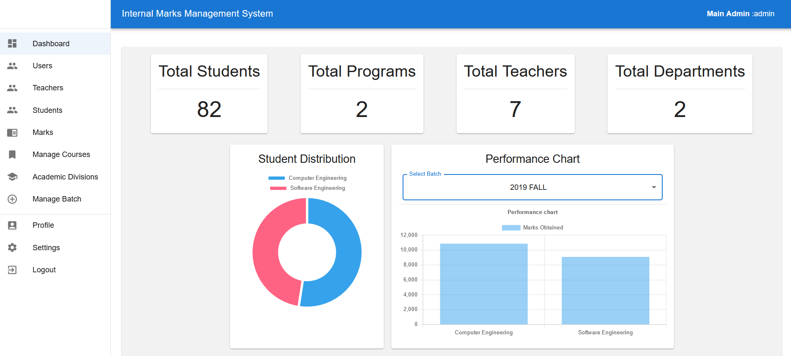
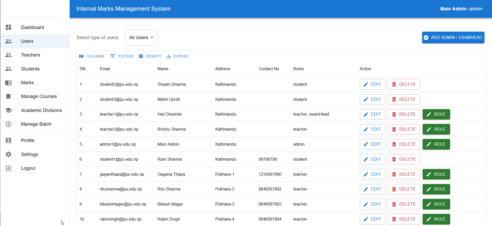
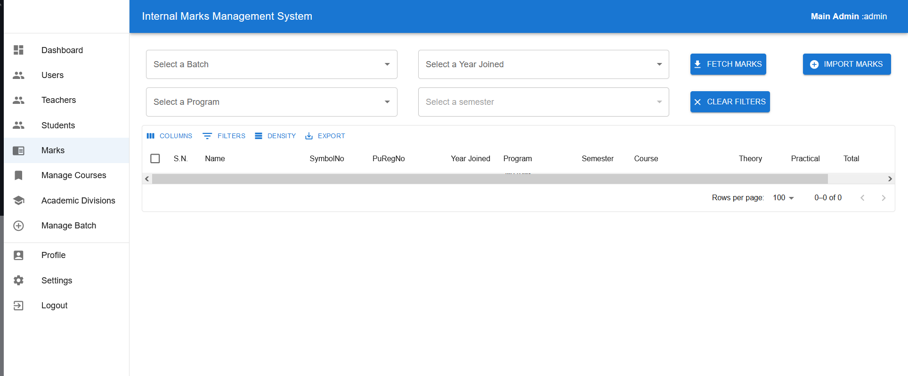
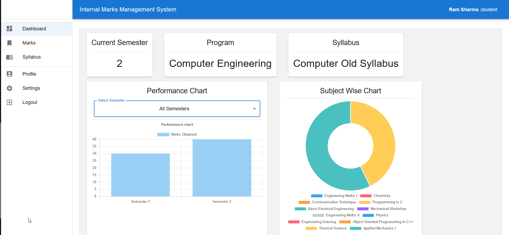
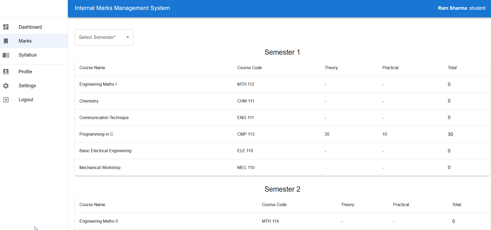
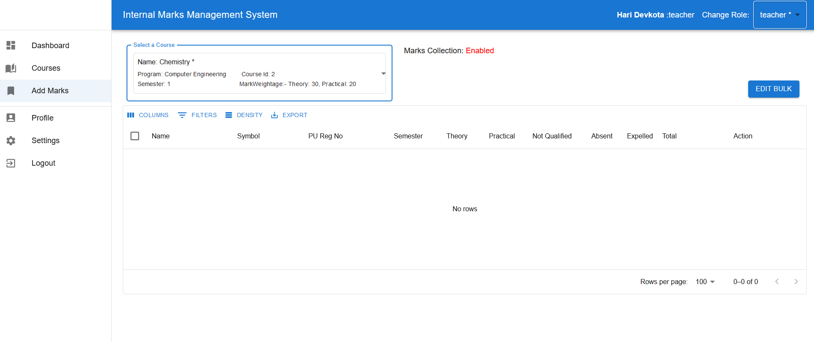

# MARKS MANAGEMENT SYSTEM - FRONTEND

The frontend for the marks managment system which is aimed to be used by universities and other educational institutes.

## NECESSARY TOOLS

1. node, npm, pnpm
2. Vscode
3. Git

## Run

1. Git clone the directory
2. Inside the directory `marks-mgmt-frontend`
   <br/>Run:
   ```bash
   pnpm install
   cp .env.example .env
   ```
3. Edit `.env` file as required
4. Run in dev mode:

```bash
   pnpm run dev
```

4. Run in production mode:

```bash
   pnpm run prod
```

_Note: Run `pnpm run lint-fix` to fix auto-fixable linting problems_

### Features

1. Supports Multiple User Type (Admin, Teacher, Student, ExamHead)
2. Supports Bulk Data Import (csv)
3. Student can view their marks, syllabus and other details.
4. Teacher can add, view marks for their courses
5. Admin can overview overall processes of the system.
6. Supports multiple academic divisions: faculties, departments, programs and syllabus
7. Supports more: Semester upgrade, marks mgmt and export, role mgmt, course mgmt,....

### Screenshots







